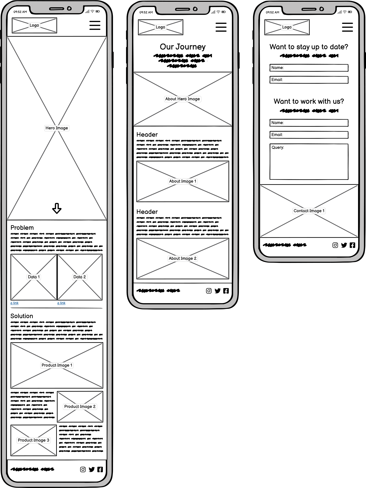
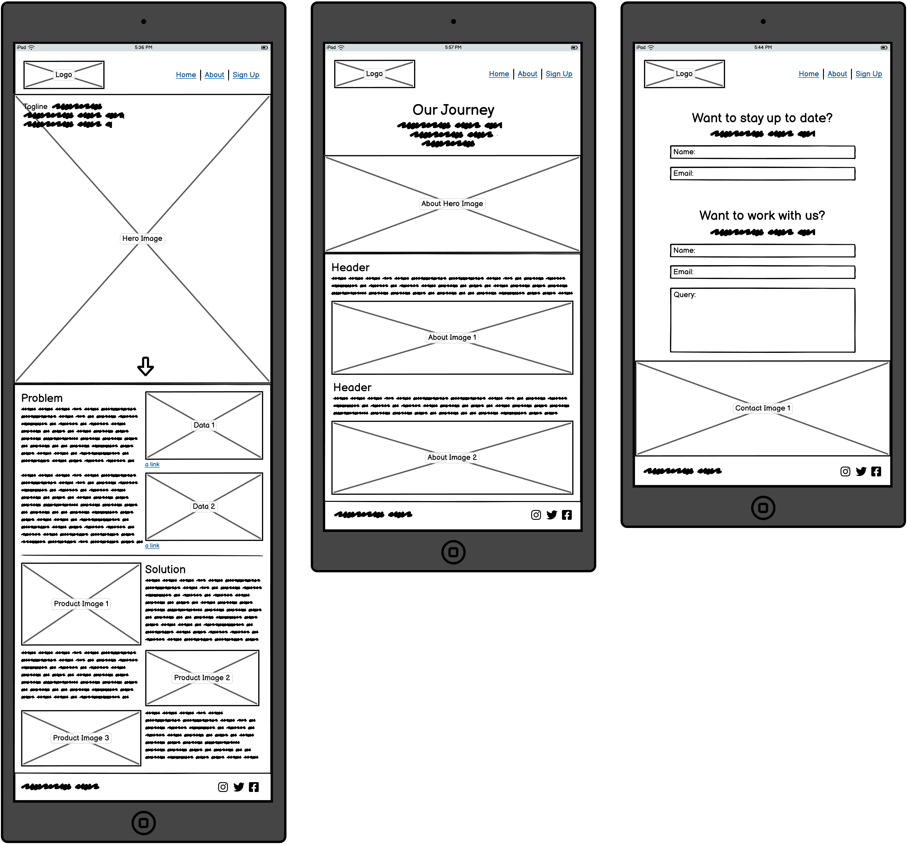
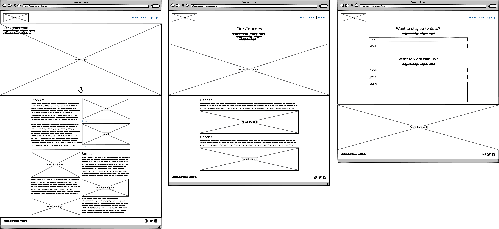
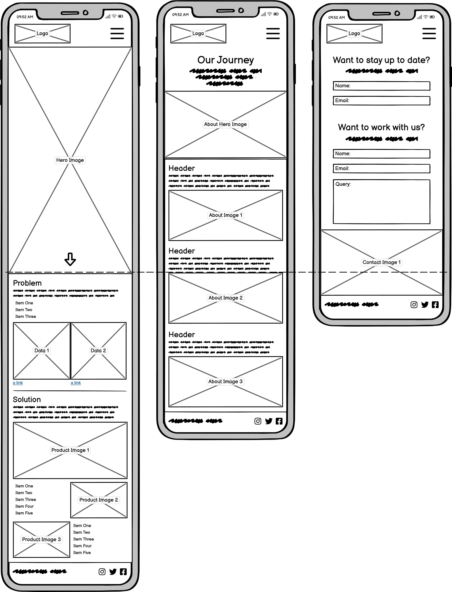
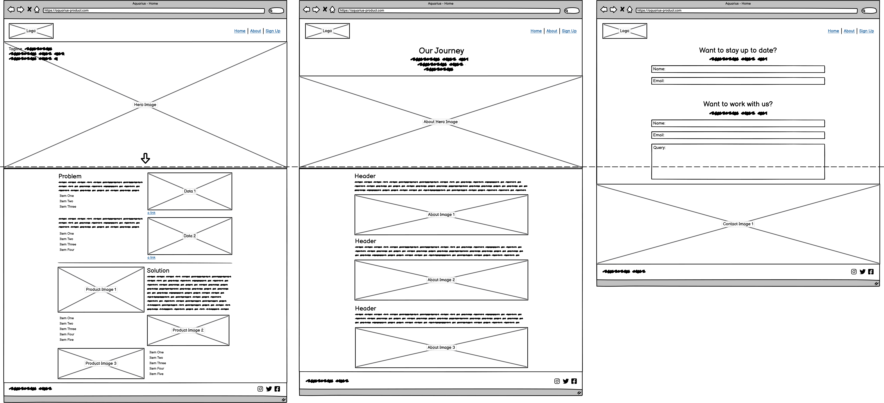
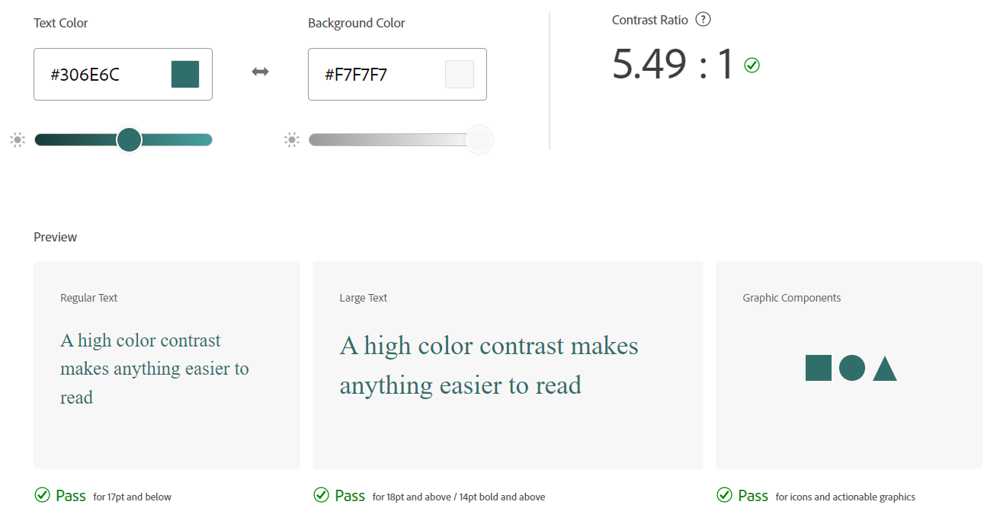
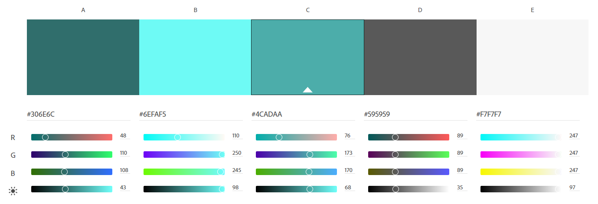

# Aquarius Start Up Site *- Milestone Project One*

Find the final project here: **_link to final project_**

A website introducing the Aquarius product to the world, consisting of a Home page, About page and, Sign Up page. The Home page showcases the product and it's USPs; the About page explains the development journey of the product and; the Sign Up page allows users to sign up for updates as well as contribute to the cause.

**_image of final site renders_**

***

## Table of Contents
1. [The Aquarius Product](#what-is-aquarius)
2. [Project Conception](#project-conception)
3. [User Experience](#user-experience)
4. [Project Management](#project-management)
5. [Universal Site Elements](#universal-site-elements)
6. [Home](#home-indexhtml)
7. [Our Journey](#our-journey-abouthtml)
8. [Sign Up](#sign-up-signuphtml)
9. [Deployment](#deployment)
10. [Testing](#testing)

***

## What is Aquarius?
Aquarius is a conceptual design for a water quality tester that was developed during my final year of university. The aim behind the product is to solve the problem of sewage contamination affecting regular water users as well as the local environment.

The product is designed with swimmers and surfers in mind, allowing them to rapidly and easily test water quality due to it's use a microfluidics technology and intuitive user interface.

**_image of aquarius_**

***

## Project Conception
Since Aquarius is still a conceptual design and requires at least 2 more years of work to get into production, a start up site felt fitting. It brings awareness to the product as well as the key problem at hand and begins the marketing campaign without having a physical product ready to sell.

Below are the initial pen & paper wireframes for the site:

***

## User Experience

### **Project Goals**
The primary goal of the site is to provide a simple and informative interface where user's can learn about the product and it's journey through development as well as sign up to receive updates on the product. Aquarius has two target audiences:
1. Water users such as, surfers, wild swimmers and kayakers.
2. Charities or agencies involved in water sports or coastal/ river environments.

### **User Scenario One**:
**User:** Wild Swimmer, 26,  based in Penzance

**Their Goals:**
* Understand the affects of sewage contamination
* Learn how Aquarius can benefit them
* Find out more about the progress of Aquarius
* Find out what they can do *now* to help in the fight against sewage contamination

**How the site helps them:**
* Explains, with data, the impact sewage contamination has on water users
* Provides information about the Aquarius product
* Shows the journey of Aquarius from problem to product
* Provides a newsletter sign up to find out more about Aquarius' progress
* Provides information on virtual, local and national causes against sewage contamination

### **User Scenario Two**:
**User:** Charity Worker, 38, based in Bournemouth

**Their Goals:**
* Learn how Aquarius could benefit their organisation and the public
* Enquire about a collaboration or bulk order
* Find out more about the progress of Aquarius

**How the site helps them:**
* Provides information about the Aquarius product
* Provides a newsletter sign up to find out more about Aquarius' progress
* Provides contact information for collaborations and pre-orders

### **Wireframes**
Balsamiq Mobile Wireframes:

Balsamiq Tablet Wireframes:

Balsamiq Desktop Wireframes:

### **Wireframe Testing**

The above wireframes were tested with two users to collect their thoughts and opinions on the current site layout as well as what they thought could be improved to make the site more user-friendly. Without specific site content, they both felt it was difficult to visualise the site, therefore once the main structure of the site is developed, the site will be tested with them again to fina areas for improvement.

Both users did notice a lot of text on the site, which on the dekstop version was fine, however, on the mobile and tablet versions they felt it was a lot of undigestable content. The wireframes were updated to represent text as a mixture of paragraphs and lists to ensure that during site development this would be kept in mind. Screen sizes have also been added to the wireframes to show what content is shown on the initial view of each page.

Updated Mobile Wireframes:

Updated Tablet Wireframes:

Updated Dekstop Wireframes:

***

## Design

### Colours
Aquarius already has a colour scheme designed into the product itself consisting of #4CADAA and #ABABAB, so it made sense to keep the original two colours and add accent colours around those to keep the site and product images within the same theme.

Here are the shades of the original accent colour from Aquarius, the colours that will be tested are highlighted in yellow.

Here are the shades of the original base colour from Aquarius, the colours that will be tested are highlighted in yellow.

Various combinations of the chosen six colours were tested using Adobe Colour's accessibility tools, below are the three combinations that passed the minimum colour contrast ratio check.

Here is the final colour scheme for the site:

Colour Assignments:
* Dark Blue #306E6C - Header and footer background
* Bright Blue #6EFAF5 - Hyperlinks, hovers, clicked links
* Mid Blue #4CADAA - Icons, graphics
* Dark Grey #595959 - Bulk text
* Off White #F7F7F7 - Site background, text on dark blue

### Typography
The Aquarius logo consists of Futura, however this is not a Google Font so is less likely the user will actually be able to view the font, it's also overused and common within industry for a company to use a different font from it's logo. Therefore, the chosen fonts for this site are Google Fonts: Fjalla One and Oxygen.

Fjalla One will be used for headers, taglines and navigation, the following screenshots show testing of Fjalla One in standard case and uppercase. Uppercase will be used for the navigation and standard case will be used within page content.

Oxygen will be used for paragraph text, links and the footer, the following screenshot shows testing of Oxygen at 16px, browser default.

***

## Project Management

### Languages Used
* HTML5
* CSS3

### Version Control
During site development GitHub was used to manage versions of each file, commits were made often and consisted of small bite-sized edits to individual features to make it easier to roll back the site to a previous version, if required. This meant the site could be rolled back to a previous version of a feature without impacting other features or making huge changes across the site. 

***

## Universal Site Elements

### External Links Used Across Site
bootstrap CSS
fontawesome icons
google fonts

### Header & Footer

### Navigation

***

## Home (index.html)
Pop-Ups/ Audio or Video - Needs something for the user to control

***

## Our Journey (about.html)

***

## Sign Up (signup.html)

***

## Deployment

***

## Testing
### Validation - CSS (Jigsaw), HTML (W3C)
### Mobile
### Tablet
### Desktop
### Large Screens?

github - elainbroche-dev/

***

## Credits & Acknowledgements

navbar javascript: https://bootstrap-menu.com/detail-fixed-onscroll.html?fbclid=IwAR3Hoo45FodP7x-jv1Rt9Cl6LSx2J2AKoAXP1qmmECSU2XaOZ35r7C97e4A