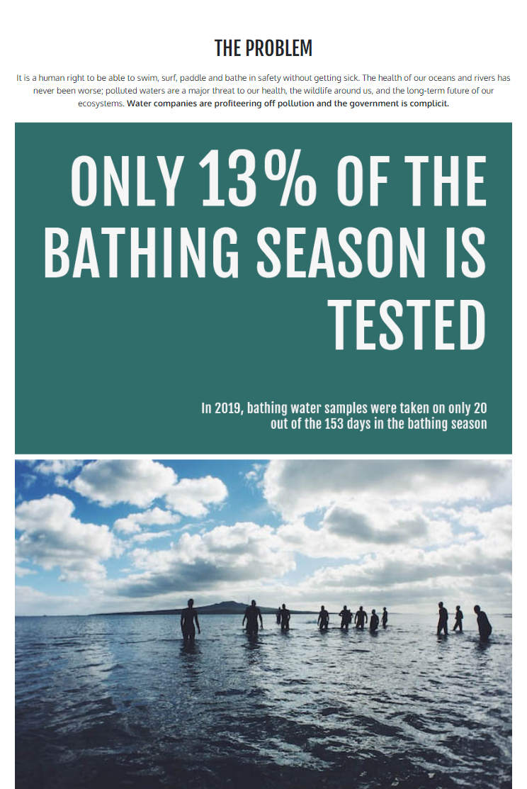
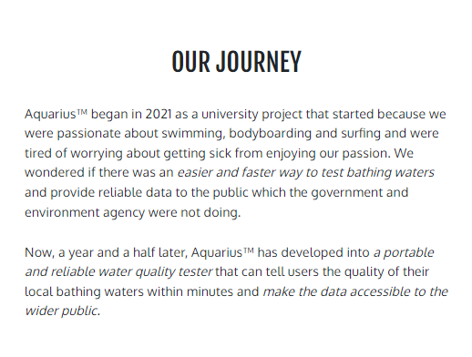
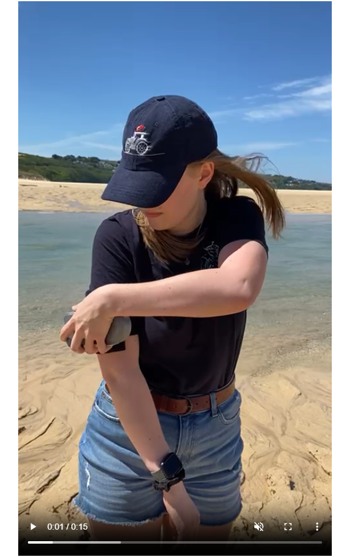

# Aquarius Start Up Site *- Milestone Project One*

**Find the final project here:** https://github.com/Renz2299/aquarius_mp1

A website introducing the Aquarius product to the world, consisting of four pages: a Home page, About page, Support Page and, Sign Up page. The Home page showcases the product and it's USPs; the About page explains the development journey of the product; the Support page tells users how they can support and contribute to the cause and; the Sign Up page allows users to sign up for updates in the form of a monthly newsletter.

***

## Table of Contents
1. [Project Overview](#project-overview)
2. [User Experience](#user-experience)
3. [Design Choices](#design-choices)
4. [Project Management](#project-management)
5. [Site Features](#site-features)
    * [Universal Site Elements](#universal-site-elements)
    * [Home](#home-indexhtml)
    * [Our Journey](#our-journey-abouthtml)
    * [Support](#support-supporthtml)
    * [Sign Up](#sign-up-signuphtml)
6. [Deployment](#deployment)
7. [Testing](#testing)
    * [Responsiveness](#responsiveness)
    * [Browser Compatibility](#browser-compatibility)
    * [Bug Fixes](#bug-fixes)
    * [Lighthouse Testing](#lighthouse-testing)
    * [Code Validation](#code-validation)
    * [User Story Testing](#user-story-testing)
    * [Feature Testing](#feature-testing)
8. [Future Improvements](#future-improvements)
9. [Credits & Acknowledgments](#credits--acknowledgements)

***

## Project Overview

### Firstly, what is Aquarius?
Aquarius is a conceptual design for a water quality tester that was developed during my final year of university. The aim behind the product is to solve the problem of sewage contamination affecting water users as well as the local environment.

The product is designed with swimmers and surfers in mind, allowing them to rapidly and easily test water quality through it's use of microfluidic technology and an intuitive user interface.

### Project Conception
Since Aquarius is a conceptual design and still requires work to get into production, a start up site felt fitting for milestone project one. It brings awareness to the product as well as the key problem at hand and begins the marketing campaign without having a physical product ready to sell.

Below are the initial pen & paper wireframes for the site, showing a home, about and subscribe page:

***

## User Experience

### **Project Goals**
The primary goal of the site is to provide a simple and informative interface where user's can learn about the product and it's journey through development as well as sign up to receive updates on the product and find out about how they can support the cause. Aquarius has two main target audiences:
1. Water users such as surfers, wild swimmers and kayakers.
2. Charities or agencies involved in water sports or coastal/ river environments.

### **Persona One**
**User:** Jessie, 26, Wild Swimmer 

Jessie is a jewellery maker based in Penzance, every morning she goes cold water swimming with a friend at her local beach, it's a daily ritual for her that brings her a sense of fulfillment and pleasure from connecting with our natural environment.

**Jessie's Goals:**
* Continue wild swimming every morning without the worry of sewage contamination.
* Understand the affects of sewage contamination on her local bathing spot.
* Learn how Aquarius could benefit her and other water users.
* Find out about the progress of Aquarius, including when it's available to order.
* Find out what she could do now to help in the fight against sewage contamination.

**How the site helps Jessie:**
* Explains how Aquarius can mitigate the affects of sewage contamination on water users.
* Explains, with data, the impact sewage contamination has on water users.
* Provides information about the Aquarius product.
* Shows the journey of Aquarius from problem to product.
* Provides a newsletter to find out more about Aquarius' progress into production.
* Provides information on local and national causes she could join to fight against sewage contamination.

### **Persona Two**
**User:** Matthew, 48, Surfing Coach & Charity Worker

Matthew is a volunteer for an environmental charity based in Bournemouth that focusses on water pollution and sewage contamination. He teaches surfing three days a week at his local beach and enjoys the adrenaline surfing gives him, he sees it as a form of meditation.

**Matthew's Goals:**
* Learn how Aquarius could benefit his charity and surf school.
* Enquire about a collaboration or bulk order.
* Find out more about the progress of Aquarius, including when it's available to order.
* Find out about events his charity could join to aid in the fight against sewage contamination.

**How the site helps Matthew:**
* Provides information about the Aquarius product.
* Provides a newsletter to find out more about Aquarius' progress into production.
* Provides contact information for collaborations.
* Provides information on local and national causes anyone can join to fight against sewage contamination.

### **Wireframes**
The initial wireframes were mocked up in Balsamiq before showing to users for testing the site layout.

**Home Page**

The home page consists of a full height image followed by easy to read facts and figures about sewage contamination and information about the Aquarius product, how it works and how it can help water users.

**About Page**

The about page explains the development journey of Aquarius from an idea to the final product.

**Sign Up Page**

The sign up page consists of two forms, one for users to subscribe to a monthly newsletter and another for users to get in contact about collaborating with Aquarius.

### **Wireframe Testing**

The wireframes were tested with two users to collect their thoughts and opinions on the current site layout and what they thought could be improved to make the site more user-friendly.

Both users felt there was a lot of text on the home and about pages, which on desktop was fine, however, on mobile and tablet felt it was a lot of indigestible content. The wireframes were updated to represent text as a mixture of paragraphs and lists to ensure this would be kept in mind during site development. Screen sizes have also been added to the wireframes, showing what content is on the initial view of each page.

**Updated Home Page**

**Updated About Page**

**Updated Sign Up Page**

***

## Design Choices

### Colours
Aquarius already has a colour scheme designed into the product itself consisting of #4CADAA and #ABABAB, so it made sense to keep the original two colours and add accent colours around them so the site and product images were within the same theme.

Here are the shades of the original accent colour from Aquarius, the colours that will be tested are highlighted in yellow.

Here are the shades of the original base colour from Aquarius, the colours that will be tested are highlighted in yellow.

Various combinations of the chosen six colours were tested using Adobe Colour's accessibility tools, below are the three combinations that passed the minimum colour contrast ratio check.

Here is the final colour scheme for the site:

The lightest blue was made slightly lighter since when it was placed within the colour scheme it felt too neon.

During site development, the darkest blue felt too light and was changed for a darker colour, here is the updated colour scheme.

Colour Assignments:
* Dark Blue #102930 - Header and footer background
* Bright Blue #A1FAF5 - Hovers, clicked links
* Mid Blue #4CADAA - Links in text, graphics
* Dark Grey #595959 - Bulk text
* Off White #F7F7F7 - Site background, text on dark blue

### Typography
The Aquarius logo consists of Futura, however this is not a Google Font so it is less likely to always be available. Therefore, the chosen fonts for this site are Google Fonts: Fjalla One and Oxygen.

Fjalla One will be used for headers, taglines and navigation, the following screenshots show testing of Fjalla One in standard case and uppercase. Uppercase will be used for the navigation and standard case will be used within page content.

Oxygen will be used for paragraph text, links and the footer, the following screenshot shows testing of Oxygen at 16px.

***

## Project Management

### Languages Used
* HTML5
* CSS3
* JavaScript (a very small amount within a single site feature)

### Version Control
During site development GitHub was used to manage versions of each file, commits were made often and consisted of small bite-sized edits to individual features so it would be easier to roll back the site to a previous version if required. Since this was my first project completed using HTML and CSS, there was a steep learning curve and many coding sessions that didn't feel as productive as hoped and others that were much easier than anticipated. In total there were 50 commits for this project, details of the commits can be found here: https://github.com/Renz2299/aquarius_mp1/commits/main

***

## Site Features

### Universal Site Elements

#### **External Links Used Across Site**
Bootstrap CSS framework was used throughout the site to aid in developing a responsive, well-laid out website. This framework allowed the main structure of the site to be developed quickly, therefore more time could be spent appropriately styling the site and fine tuning elements.

Font Awesome icons were used for the social links in the footer as well as for the animated arrow on the home page.

Two Google fonts were used throughout the site: Fjalla One and Oxygen. Details on the choice of these fonts can be found in the [Typography](#typography) section above.

#### **Header & Main Navigation**
The header of the site consists of the Aquarius logo on the left and the primary site navigation on the right. On the home page the header has a transparent background so it sits on top of the cover image. Once the user begins to scroll the background transitions to dark blue with a slight drop shadow. On all other site pages, the header has the dark blue background colour and the transition has been removed.

On screen sizes smaller than 768px wide the main navigation will become a hamburger button that can be toggled to show the navigation in a dropdown format. Due to this, the navigation bar had to become a solid colour throughout the whole page, meaning the transparent to solid animation couldn't be applied to these screen sizes.

Site header on screens 768px and above:

Site header on screens below 768px:

#### **Footer**
The footer consists of copyright information on the left and social links on the right all on a dark blue background.

On screen sizes below 576px wide, the two columns of content stack and float on the right-hand side of the footer.

Site footer on screens 576px and above:

Site footer on screens below 576px:

***

### Home (index.html)
The home page begins with a cover image of the aquarius product that fills the whole height of the screen. This was done using 'height: 100vh;'.

In the top left of the image is a tagline about Aquarius to introduce the user to the product and indicate what is in the image. At the bottom right of the image is text indicating the product is coming soon and when pre-order will be available. Both areas of text were positioned using 'position: absolute;' to place it within the cover image. On screens 768px wide and below a grey box is applied behind the tagline to make it visible against the background because the white in the image sits behind the text.

Since this image fills the whole height of the screen, an animated arrow was added to the bottom centre of the image to indicate to the user they can scroll down for more content. This arrow is the font awesome icon: 'fa fa-chevron-down' and was animated using 'bounce' with keyframes to control the exact movement of the arrow. It was positioned using 'position: relative;' to place it at the bottom centre of the cover image.

Cover image, text and arrow at 992px wide:

Cover image, text and arrow at 768px wide:

The home page content was structured using bootstrap rows and columns with the custom classes 'img-width-100' and 'img-height-100' to ensure images took up the full height or width of their column/ row.

On screen sizes below 992px wide 'class*' was used in the CSS to target all 'col-md-' elements and make them 'width: 100%;' so that columns would be stacked to make the content easier to digest.

Also, the Microfluidic Technology paragraph was quite long and became problematic on smaller screen sizes. Therefore, the bulleted list from that paragraph was removed on screens below 992px wide.

Home page content at 1200px wide:

Home page content at 992px wide:

***

### Our Journey (about.html)
The first section of the about page is a centred paragraph explaining how the Aquarius product began, followed by three images illustrating the final prototype of Aquarius along with the testing that went into it's development. Originally, the wireframe for this page had one full width image in this section, however, when looking at the media available most of the imagery was portrait,therefore three images contained within one row better suited the page.

The images were placed in three columns of equal width within a single row. Unlike the home page, these columns do not stack on screens beneath 992px because it would leave a lot of imagery to scroll through before getting to the text beneath. Instead these images are set to a width of 33% on screens beneath 992px wide, and on screens beneath 576px wide, they are hidden as they become too small to fully understand. Also, on screens below 576px wide, the text within this header becomes aligned on the left to match the rest of the text on the page.

About header on screen size 1200px wide:

About header on screen size 576px wide:

Similar to the header, the rest of the imagery is contained in rows and then either two or three columns depending on the amount of images in a section. These columns are still set to stack on screens below 992px wide.

In the 'Developed Through Testing' section, there is an mp4 video with controls showing a small snippet of the Aquarius testing process. On screens above 992px wide it is 33% of the screen width and on screens 992px wide and smaller it stacks with the images in that section.

Video on screen size 576px wide:

***

### Support (support.html)
The support page was a later addition to the site because the second form on the sign up page, intended for users wanting to work with Aquarius, didn't make sense being on a page named 'Subscribe'. Therefore the support page was created for housing this form along with information about ways users can help in the fight against sewage contamination.

The support page begins with three columns containing information about how users can support the cause. Each column contains an image, header and short paragraph that will stack on screens 992px wide and below.

Ways to support the cause on screen size 1200px:

Ways to support the cause on screen size 576px:

At the bottom of the support page is a form for users to send enquiries about collaborating with Aquarius, this is intended for users that want to create content containing the Aquarius product, place a wholesale order or anything other enquiries.

The form contains a field for first name, last name, email address and the user's message. It is centred on the page at 70% of the screen width, however on screen sizes over 1200px wide, it is set to 840px wide and a calculation is used to keep the left margin at half the size of the blank screen space. This prevents the form from growing too large on wide screen monitors.

Collaboration form on screen size 1500px:

Collaboration form on screen size 576px:

***

### Sign Up (signup.html)
On the Sign Up page, the first feature is the subscribe form for users to enter their name and email address to sign up to the Aquarius newsletter. Similar to the collaboration form on the Support page, this form has the same style attributes to determine it's size, font and colours.

Subscribe form on screen size 1500px:

Subscribe form on screen size 576px:

Upon completion of either form on the site, the user is directed to a Thank You page, indicating their details have been recorded. This page still contains the site header, navigation bar and footer, meaning the user never leaves the site and can still return to read more information about Aquarius.

Thank You page on screen size 1200px:

The same full width image is used at the bottom of the Sign Up page and the Thank You page to keep the theme between the pages.

The image has been made full width by not placing it within a bootstrap row or column and using the 'img-width-100' class.

Full width image on screen size 1200px:

***

## Deployment

The site was deployed on GitHub Pages using the following steps:
1. From the repository, go to the 'Settings' tab.
2. Go to 'Pages'.
3. Select 'Deploy from a branch' as the Source.
4. Select 'main' and '/(root)' as the Branch.
5. Click Save.
6. View the deployed site using the 'Visit site' button at the top of the page.

***

## Testing
### Responsiveness

Site tested on iPhone XR:

Site tested on iPad Pro:

Screen Width | | | | | Device | | | | | Notes
---: | :---: | :---: | :---: | :---: | :---: | :---: | :---: | :---: | :---: | :---
| | Galaxy S9+ (320px) | iPhone 6/7/8 (375px) | iPhone XR (414px) | iPad Mini (768px) | iPad Air (820px) | Surface Pro 7 (912px) | iPad Pro (1024px) | Desktop (1201px) | Desktop (2000px) | My phone: iPhone 8. All others tested virtually
<=576px | Good | Good | Good | NA | NA | NA | NA | NA | NA |
576px< >=992px | NA | NA | NA | Good | Good | Good | NA | NA | NA | 
992px< | NA | NA | NA | NA | NA | NA | Good | Good | Good |
Links/ URLs work | Yes | Yes | Yes | Yes | Yes | Yes | Yes | Yes | Yes |
Images work | Yes | Yes | Yes | Yes | Yes | Yes | Yes | Yes | Yes |
Renders as expected | Yes | Yes | Yes | Yes | Yes | Yes | Yes | Yes | Yes | Signup.html too short, footer doesn't sit at bottom

### Browser Compatibility

| | Browser | | | | | Notes
:--- | :---: | :---: | :---: | :--- | :--- | :---
| | Chrome | Edge | Firefox | Safari | Ecosia
Intended Appearance? | Good | Good | Good | Good | Good | Site appears as expected on all browsers tested
Intended Responsiveness? | Good | Good | Good (only tested on mobile) | Good (only tested on mobile) | Good | Site responds as expected on all browsers tested

### Bug Fixes

**Bug One:** Pre-order line very close to left edge of screen on narrow mobile screens. This was resolved by changing the width of that paragraph to 80vw irrespective of screen size.

Screenshot of before and after

**Bug Two:** Footer on signup.html doesn't touch the bottom of the page on screens that are taller than they are wide. Media query added for screens between 875px and 1370px to place the footer and full width image at the bottom of the page. This was done using 'position: absolute' and 'bottom: 0'.

Screenshot of before and after

**Bug Three:** Social link href's were only included on index.html. This was an easy fix that just required copying the links across to the site subpages.

**Bug Four:** Full width image on signup.html covers the form on widescreen displays. This fix isn't completely resolved, I would've liked to make the image height shrink depending on the screen size so there was no overlap between the image and the form, however towards the end of the project there wasn't a huge amount of time left and resource was better used in continuing the site testing. Therefore, a temporary fix for this problem was to set the subscribe form to 'z-index: 1' so it would render above the image on widescreens.

### Lighthouse Testing

Lighthouse testing was carried out on each deployed site page using Chrome Developer Tools. After each test, relevant changes were made to the page and the site was redeployed and tested again.

#### **Index.html**

The first test of index.html came back with a low accessibility and SEO rating, due to the lack of alt text on some images and links as well as a missing meta description. Alt text was added to the relevant images and links and a meta description was added, this was also done for the site subpages prior to their lighthouse test.

#### **About.html**

About.html unfortunately came back with a low performance rating, which cannot be improved much further due to the page containing a video.

#### **Support.html**

Support.html didn't need much improvement from it's initial lighthouse rating, however the test did point out the poor contrast between the external link colour and the background, therefore the colour of the links was changed to #4CADAA and is now more readable.

#### **Signup.html**

The lighthouse test for signup.html came back very positive, therefore no changes were needed to this page.

### Code Validation

| | Validations | Notes
---: | :--- | :---
HTML | Checked on: https://validator.w3.org/ | **Errors:** Trailing '/' in link tags in head element, footer link missing '/', favicon missing '/png' in type attribute, video width moved to style.css. All errors now resolved. **Warning:** Subpages missing h1-h6 element in certain sections. First section is navbar and style of pages don't require headers in all sections.
CSS | Checked on: https://jigsaw.w3.org/css-validator/ | **Error:** Invalid background-color property, changed to transparent. **Warning:** Quote marks missing around font-family name that contains spaces. All errors and warnings now resolved.
JavaScript | Checked on https://jshint.com/ | No errors or warnings.

### User Story Testing

User Story | Testing
:--- | :---
As a water user I want to read about Aquarius, how it works and how it could benefit me. | On the Home page, scroll to the 'Solution' section. Details of how Aquarius works to test water quality is located within that section.
As a water user I want to understand how sewage contamination affects me and my local bathing spot. | On the Home page, scroll to the 'Problem' section. Facts and figures about water quality and sewage contamination are located within that section.
As a product consumer I want to find out where Aquarius came from and how it was developed. | The About page contains the entire journey of Aquarius, including where the idea came from and how it was developed into the final solution.
As a water user I want to find out about water activism events happening near me. | On the Support page, the top section includes links to find local beach cleans and protests as well as online petitions.
As a water user I want to find out how I can work with Aquarius to improve my local bathing waters. | On the Support page, at the bottom is a form where users can provide their details if they'd like to collaborate with Aquarius.
As a site user I want to sign up to the Aquarius newsletter to get information directly to my inbox. | On the Subscribe page is a short form for users to provide their name and email so they can receive the Aquarius newsletter.

### Feature Testing

Feature | Action | Effect
:--- | :--- | :---
Logo (top left corner) | Hover over | The cursor changes to a pointer (hand)
Site Navigation (>=768px wide) | Hover over | Page names change from off-white (#F7F7F7) to light blue (#A1FAF5)
| | Click | Directs user to selected site page
Site Navigation (<768px wide) | Hover over | Toggler button changes from off-white (#F7F7F7) to light blue (#A1FAF5)
| | Click | Opens drop down navigation menu
| | Hover over | Page names change from off-white (#F7F7F7) to light blue (#A1FAF5)
| | Click | Directs user to selected site page
Footer Links | Hover over | Icons change from off-white (#F7F7F7) to light blue (#A1FAF5)
| | Click | Opens selected social page in new tab
Video | Click anywhere on video | Video begins
| | Click anywhere on video | Video pauses
| | Click speaker button | Video unmutes
| | Click full screen button | Video becomes full screen
| | Click along progress bar | Skips to that time in video
Support Links | Click 'beach clean' | Opens Surfers Against Sewage beach cleans page in new tab
| | Click 'here' | Opens Surfers Against Sewage 2023 protest calendar in new tab
| | Click 'petition' | Opens Surfers Against Sewage' Dirty Money petition sign up in new tab
Collaboration Form | Hover over data fields | Border changes from off-white (#F7F7F7) to light blue (#A1FAF5)
| | Click in data field | Border weight increases and type cursor appears
| | Hover over 'SUBMIT' | Button colour changes from dark blue (#102930) to light blue (#A1FAF5). Font colour changes from off-white (#F7F7F7) to dark blue (#102930)
| | Click 'SUBMIT' | If data fields filled in correctly: Directs user to thank you page. If data fields not filled in correctly: Alerts user which field is missing or has incorrect data
Sign Up Form | Hover over data fields | Border changes from off-white (#F7F7F7) to light blue (#A1FAF5)
| | Click in data field | Border weight increases and type cursor appears
| | Hover over 'SUBSCRIBE' | Button colour changes from dark blue (#102930) to light blue (#A1FAF5). Font colour changes from off-white (#F7F7F7) to dark blue (#102930)
| | Click 'SUBSCRIBE' | If data fields filled in correctly: Directs user to thank you page. If data fields not filled in correctly: Alerts user which field is missing or has incorrect data

***

### Future Improvements

Upon completing this project, I am m very happy with the final result and there isn't a huge amount of improvement I would like to make. However, one of the key improvements I would make is to swap all .jpg and .png files for .webp to improve the overall loading speed of the site. Another improvement, that was previously mentioned in the [bug fixes](#bug-fixes) section, would be to figure out why the full width image on signup.html overlaps the form on widescreens and find a solution that works on all screen sizes.

***

## Credits & Acknowledgements

The navbar HTML was sourced from: https://bootstrap-menu.com/detail-fixed-onscroll.html?fbclid=IwAR3Hoo45FodP7x-jv1Rt9Cl6LSx2J2AKoAXP1qmmECSU2XaOZ35r7C97e4A. This aided in creating a customisable bootstrap navbar that would allow for a toggler button with dropdown on mobile and tablet.

The navbar animation JavaScript was sourced from: https://stackoverflow.com/questions/36246878/how-to-make-a-transparent-navbar-visible-when-scrolling. This aided in creating a navbar that would be transparent initially and transition into a solid colour upon scrolling.

The animated arrow CSS was sourced from: https://dzone.com/articles/css-bouncing-arrow. This aided in creating a bouncing arrow that could sit on top of the cover image on index.html to tell users to scroll for more content.

Stock images were sourced from Unsplash
* surfer.jpg: Austin Neill on Unsplash (https://unsplash.com/photos/uHD0uyp79Dg)
* swimmers.jpg: Artem Verbo on Unsplash (https://unsplash.com/photos/w8sxtkYsRns)
* seawater.jpg: Matt Hardy on Unsplash (https://unsplash.com/photos/6ArTTluciuA)
* research.jpg: Brands&People on Unsplash (https://unsplash.com/photos/Ax8IA8GAjVg)
* research_1.jpg: FORTYTWO on Unsplash (https://unsplash.com/photos/1xMG-yqR2GM)
* beach_clean.jpg: Brian Yurasits on Unsplash (https://unsplash.com/photos/zBEE5as5XpY)
* petition.jpg: The Climate Reality Project on Unsplash (https://unsplash.com/photos/zr3bLNw1Ccs)
* protest.jpg: Clem Onojeghuo on Unsplash (https://unsplash.com/photos/DoA2duXyzRM)

All other media is my own work.